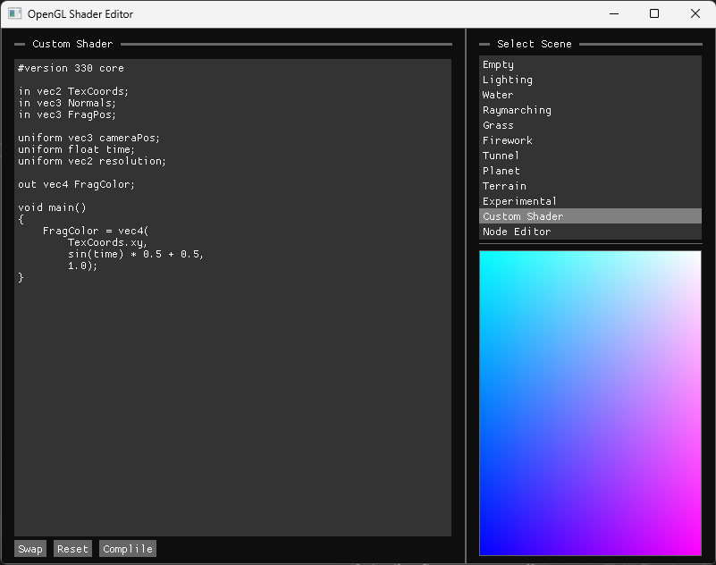
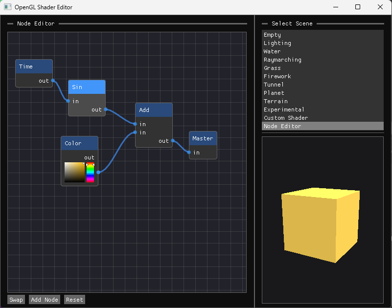

# OpenGL Shader Sandbox
-**graphics renderer** made with C++ and OpenGL / SDL  
-experimenting with **shaders, 3D piplines and software architecture**  
-custom **GLSL sandbox** inspired by [ShaderToy](https://www.shadertoy.com/)  
-simple **node graph** made with [ImNodes](https://github.com/Nelarius/imnodes)  
-additional libs: glm, assimp, imgui   

### Custom Editor

<table cellspacing="0" cellpadding="0">
  <tr>
<td>GLSL Sandbox</td>
<td>Node Graph</td>
  </tr>
  <tr>
<td></td>
<td></td>
  </tr>
</table>

### Shader Experiments

<table cellspacing="0" cellpadding="0">
  <tr>
    <td></td>
    <td></td>
    <td></td>
  </tr>
  <tr>
    <td></td>
    <td></td>
    <td></td>
  </tr>
  <tr>
    <td></td>
    <td></td>
    <td></td>
  </tr>
</table>
